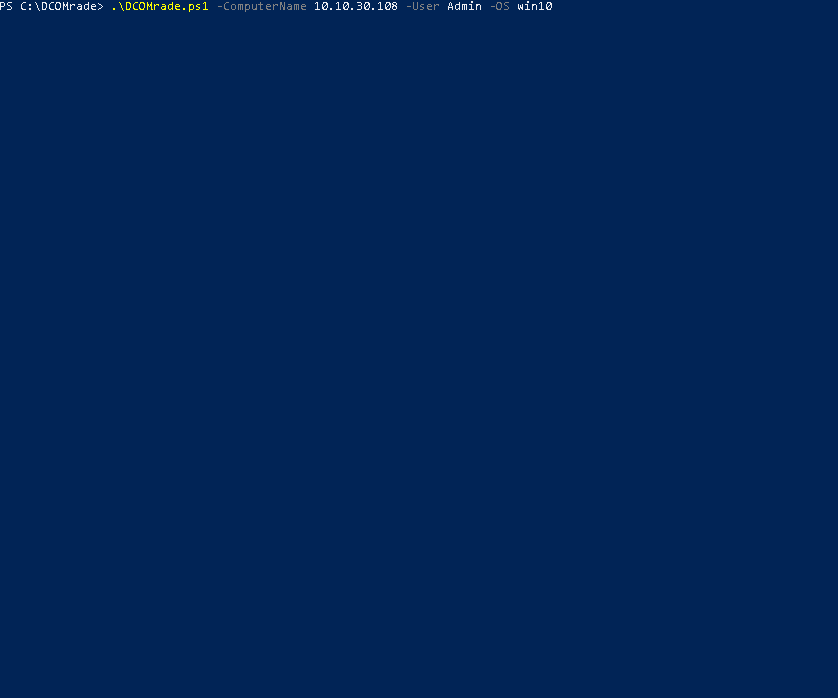

# DCOMrade
DCOMrade is a Powershell script that is able to enumerate the possible vulnerable DCOM applications that might allow for lateral movement, code execution, data exfiltration, etc. The script is build to work with Powershell 2.0 but will work with all versions above as well. The script currently supports the following Windows operating systems (both x86 and x64):

* Microsoft Windwos 7
* Microsoft Windows 10
* Microsoft Windows Server 2012 / 2012 R2
* Microsoft Windows Server 2016

## How it works
The script was made based on the research done by [@enigma0x3](https://twitter.com/enigma0x3), especially the [round 2](https://enigma0x3.net/2017/01/23/lateral-movement-via-dcom-round-2/) blogpost that goes into finding DCOM applications that might be useful for pentesters and red teams.

First a remote connection with the target system is made, this connection is used throughout the script for a multitude of operations. A Powershell command is executed on the target system that retrieves all the DCOM applications and their AppID's. The AppID's are used to loop through the Windows Registry and check for any AppID that does not have the `LaunchPermission` subkey set in their entry, these AppID's are stored and used to retrieve their associated CLSID's.

With the CLSID the DCOM application associated with it can be activated, the script does this with the CLSID of the 'Shortcut' (`HKEY_CLASSES_ROOT\CLSID\{00021401-0000-0000-C000-000000000046}`) because this is a shared CLSID across the Microsoft Windows operating systems. The 'Shortcut' CLSID is used to count the amount of `MemberTypes` associated with it, this is done to check what the default amount of `MemberType` is and check for the CLSID's that hold anything different than this amount. The CLSID's with a different amount of `MemberTypes` might hold a `Method` or `Property` that can be (ab)used, and will be added to an array.

The CLSID's in the array are being checked on strings in the `MemberTypes` that might indicate a way to (ab)use it, this list of strings can be found in the [VulnerableSubset](https://github.com/sud0woodo/DCOMrade/blob/master/VulnerableSubset.txt) file. Please note that this list is by no means a complete list to find every single vulnerable DCOM application, but this list being a dynamic part of the process should give the user of the script a way to look for specific strings that migth indicate a functionality of a DCOM application that might be useful for their purpose.

The results of the script are outputted in a HTML report and should be usable for auditing a system as a preventive measure. For the offensive side I created an Empire module which at the time of writing is awaiting approval to be added to the master branch. If you would like to add this to Empire yourself you can do so by adding the module located [here](https://github.com/sud0woodo/DCOMrade/tree/master/Empire).

For a full technical explanation of the idea, the script and possible detection methods you can read the research paper associated with this. #TODO: ADD LINK TO PAPER

## Prerequisites
The script, while not being used as an Empire module, has some limitations as the working of the script and how it connects with the target machine differs.

* For this script to work, the Windows Remote Management services need to be allowed in the Windows Firewall (5985);
* If the target system's network profile is set to `Public` the following command needs to be executed to allow Windows Remote Management services being used on the target system: `Enable-PSRemoting -SkipNetworkProfilecheck -Force`
* This script only works when one has the credentials of a local Administrator on the target system. Without these credentials you will not be able to start a remote session with the target machine, or be able to activate DCOM applications.

## Example usage
When in a Microsoft Windows domain:
```sh
.\DCOMrade.ps1 -ComputerName [Computername / IP] -User [Local Administrator] -OS [Operating System] -Domain [Domain name]
```

When not in a Microsoft Windows domain:
```sh
.\DCOMrade.ps1 -ComputerName [Computername / IP] -User [Local Administrator] -OS [Operating System]
```


## Limitations
* Currently the script does try to release any instantiated / activated DCOM applications but some activations start new processes (such as Internet Explorer), the process could be stopped but this would mean that if a user on the target system is using that particular application, this process will stop for them as well;
* Another thing, which probably has to do with bad my coding skills, is that the script might introduce considerable load on the target system if the target system does not have a lot of resources. Be considerate when using this in a production environment or on servers;
* The script might take some time to execute completely, this depends on the amount of DCOM applications and the size of the vulnerable subset file.


